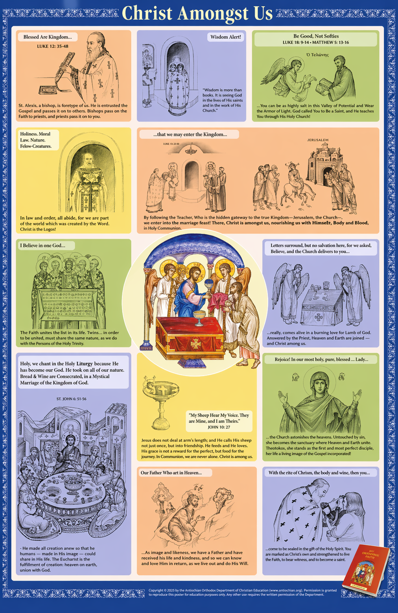

# week 1

Questions

Fasting before communion

**Relevant excerpts:**

Based on Holy Communion Slides from Orthodoxy 201 Part 2 slides 5-7 and 13.

> “In the 1st place we must address that fasting is one of the ways we prepare ourselves to receive Holy Communion.”

> “The second place we must emphatically state that there is no prescribed fasting for Holy Communion.”

> “The custom that prevailed since antiquity, which continues to be in effect to this day, is to abstain from eating and drinking on Sunday morning, and on any other morning on which one intends to receive Holy Communion. There is no other communion fasting.”

> “No holy Canon prescribes that a faithful must fast before Holy Communion… the Holy Canons do not impose fasting prior to Holy Communion, neither do they prohibit it.”

> “Of course, the Church prescribes that in order to receive Holy Communion we should abstain from eating or drinking anything on the morning on which we intend to receive.”

> “Technically, the fast is from midnight on. There is no other Communion fasting.”

**Question:**  
I may be misunderstanding this, but the slides seem to say both that we fast before Communion and that there is “no prescribed fasting for Holy Communion,” except perhaps for the morning fast. Is the intended distinction that there is no universal multi-day canonical Communion fast, while the morning fast is still the normal minimum practice, subject to pastoral guidance?

---

Holy people

**Relevant excerpts:**

Holy Communion Slides from Orthodoxy 201 Part 1 slide 2 ONE IS HOLY, ONE IS LORD

**Bullet 4:** 
> Considering the same phrase, St. Nicholas Cabasilas “Not everyone is permitted to
partake of the spotless mysteries... Because the Holy Things ought to be given only to
the holy people. The word holy means all those who are perfect in terms of virtue, as
well as those who struggle to reach that kind of perfection... Because nothing prevents
them from being sanctified by partaking of the holy mysteries.”

*— St. Nicholas Cabasilas, *A Commentary on the Divine Liturgy*, ch. 36, “The proclamation of the priest to the people when he elevates the holy offerings, and their reply.” [1]*

**Questions**:

I found this passage confusing. It begins by saying, “Not everyone is permitted to partake,” but then seems to define “holy” so broadly that it could appear to include anyone seeking God. I assume the distinction hinges on how “people” is being used in this context, and how “holy” is being qualified by the surrounding passage.

1. In this passage, does “people” refer only to those who are already in the Body of Christ, namely baptized and chrismated members of the Orthodox Church?

---

**Question:**  
The reading says, “Only grave sins should keep us away from the Eucharistic Supper.” What is the Orthodox distinction between grave or mortal sins and other sins, and where is that distinction taught most clearly?

## Holy Communion Slides from Orthodoxy 201 Part 1

# slide 3-4 Frequent Communion
Slides are screenshots intead of text. Below is the text:

Personal preparedness
The decline in frequent Communion came about gradually. Following the
peace of Constantine, the awesome sacredness of Communion was increasingly
emphasized over and against the personal worthiness of the communicant, a
concept that found its way into liturgical texts: "It [Communion]is a burning
coal that sears the unworthy." In addition to one's inner preparation and the
observance of the Eucharistic fast (to eat nothing from the last meal of the day
to the time of Communion), additional external ascetical expressions of piety
were also promoted as essential for participation in the sacrament. These
included strict fast rules, abstinence from sexual intercourse, compulsory
confession, and other devotional acts. Some have suggested that the strong
emphasis on personal worthiness deterred many, fearful of condemnation,
from receiving frequently. The strict fast rules led many to connect Communion
with the great fast periods of the year (Great Lent/Holy Week, the fast of the
Apostles, the Dormition fast, and the fast of Christmas which slowly expanded
to forty days). Thus was born the idea that Communion should be received
four times or less a year.
Happily, in our days, thanks to the reemergence of devotional piety centered
on the Eucharist, many families have espoused the practice of frequent
Communion.

Of course, the challenge before every communicant is to maintain a deep
reverence for and have a clear understanding of what Holy Communion is and
means. The reception of Communion should not be reduced to an empty habit,
a hollow custom. Adults and even children - in language and imagery proper
to their age - should be taught to value Communion as an extraordinary
event, an act of faith, and a wondrous gift that is given freely by God and

not something one earns. The basic preparation for Communion is the daily
struggle to bring one's will freely into conformity with the divine will and to
love in a way that enables us to identify with Christ and with the sufferings of
the least among us.
Not for adoration but for consumption
The elevation of the Amnos should not be interpreted as a form of eucharistic
adoration. The Orthodox Church does not practice eucharistic adoration, at
least not as it is understood and practiced in the Roman Church - as an extra-
liturgical devotional practice.436 The consecrated Holy Gifts are presented and
offered not for adoration but for consumption: "Take eat ... Drink of this .... "
Nevertheless, Orthodox Christians know intuitively the awesome, sacred
character of the Holy Gifts. In their presence they bow and cross themselves
reverently fully aware of their sacred identity - the Body and Blood of Christ.
Not a blessing object
On another note, as already mentioned, the Holy Gifts should never be thought
of or used as a blessing "object." The clergy should avoid making the sign of the
cross with the Gifts over the people at the Great Entrance or when exhibiting
the chalice before and after Communion.
Τά Άγια τοϊς άγίοις
The manual act of elevating the Lamb is accompanied by the words, "Tà "Ayıa
roiç ayioi - The Holy Gifts for the Holy People of God." The exclamation, spoken
reverently by the priest as he lifts the Lamb, is both an invitation and a
warning.
The exclamation summons the faithful to Communion, to partake of the "holy
things - ta ayia." The "holy things" are none other than the Holy Gifts: the
gifts of bread and wine prepared and offered to God by the people in praise of
and in thanksgiving for his mighty acts. They are the gifts which God receives
and consecrates and are offered back to us for the forgiveness of sins and life
eternal.
We offer up human food - the emblems of our humanity - in order to receive
the Food of Life, the Body and Blood of the incarnate Son of God (John 6:55-59).
In exchange for our fleeting mortal life we receive and partake of the divine
life (2 Peter 1:4); we are given the gifts of incorruptibility and immortality.
"Then Jesus said to them, Truly, truly, I say to you, unless you eat the flesh of
the Son of Man and drink his blood, you have no life in you; he who eats my

---

436 Eucharistic adoration is practiced by Roman Catholics, at least since the sixteenth
century, in the belief that the consecrated reserved host encased in a monstrance is truly the
Body of Christ and therefore of his real presence. Eucharistic adoration is an extra-liturgical
devotional practice.

---

day" (John 6:53-54).

flesh and drinks my blood has eternal life, and I will raise him up at the last
the invitation to Communion is simultaneously a warning. The "holy things"
are for the "holy ones - tois ayiots." The unworthy are advised to stay away. "Let
not everyone come to receive," writes Cabasilas in his Commentary (4: 36), "but
only those who are worthy, for holy things are for the holy only." Or as the plea
in one of the private devotional pre-communion prayers says, "let not these
Holy Gifts be to my judgment because I am unworthy .... "
This cautionary approach to Communion was known and practiced from the
start. St. Paul, for example, makes reference to it when he wrote these words
to the Corinthians: "Whoever eats the bread and drinks the cup of the Lord
in an unworthy manner will be guilty of profaning the body and blood of the
Lord .... For anyone who eats and drinks without discerning the body eats and
drinks judgment upon himself" (1 Cor. 11:27, 29). And he continued, "Let a
man examine himself, and so eat of the bread and drink of the cup" (1 Cor.
11:28). A similar warning is embedded in the anaphora. We read in CHR, "So
that [these Holy Gifts] may be for those who partake of them for vigilance of
soul ... [and] not for judgment or condemnation." Or as it is said in BAS, "Grant
that none of us may partake of the holy Body and Blood of your Christ for
judgment or condemnation."
But Who are the Holy Ones, the äyiot, to whom Communion is Given?437
From the earliest days the term saints - ayiot, as we know from the Epistles of
St. Paul and others, was applied to the faithful, to those set apart by baptism
who conscientiously strive to live their lives in accordance with the will of
God. Here is how Cabasilas explains it. "Those whom the priest calls holy are
not only those who have attained perfection, but those also who are striving
for it without having yet obtained it .... The faithful are called saints because
of the holy thing of which they partake, because of him whose Body and
Blood they receive .... As long as we remain united to him and preserve our
connection with him, we live by holiness, drawing to ourselves, through the
Holy Mysteries the sanctity which comes from that Head and that Heart. But if
we should cut ourselves off, if we should separate ourselves from the unity of
this most holy Body, we partake of the Holy Mysteries in vain, for life cannot
flow into dead and amputated limbs."438

---

437 See Taft, Precommunion Rites, 234-40.
438 Cabasilas, Commentary, 4:36.

---

Who Then Can Receive Holy Communion?

Saint Justin the Martyr (ca. 150) gives the following concise response: "T
food we call eucharist, and no one may share it unless he believes that
teaching is true, and has been cleansed in the bath of forgiveness for sin a
of rebirth, and lives as Christ taught."" According to this ancient maxim,
partake of the Holy Mysteries one must be baptized, espouse the faith of t
Church, and walk in the newness of life (Rom 6:4). Or, as Cabasilas, puts
"Christians, if they have not committed [mortal] sins as would cut them
from Christ and bring death, are in no way prevented, when partaking of t
Holy Mysteries, from receiving sanctification, not in name alone, but in fa
since they continue to be living members united to the Head."440
Cabasilas' words, in part, are based on 1 John 5:16-17. The Apostle, Evangel
and Theologian John distinguishes between two kinds of sin, those whi
do not lead to death and those which do (mortal sins). The former, ev
when repugnant, are forgiven. The deadly mortal sins, however, are beyor
forgiveness, not because God is incapable of forgiving them, but because t
transgressors are in a continual and willful state of denial and disobedienc
they deliberately reject the truth, love, and grace of God; they blasphem
against the Holy Spirit (Matt. 12:31-33).
One is Holy, one is Lord, Jesus Christ ...
The invitation to Communion requires a proper response. Byzantine an
ecclesial etiquette demands it. In light of our human weaknesses, frailtie
and failings there could be only one, simple, direct, and appropriate response
"One alone is holy." Indeed, as Cabasilas tells it, "No one has holiness of himself
It is not the consequence of human virtue but comes to all from [God] an
through him."41 The response includes a Christological formula which affirm
the divinity of Christ: "One is Holy, one is Lord, Jesus Christ, to the glory of Go
the Father. Amen."442
We believe and confess in the Creed that the Church is holy, even though she i
not yet perfect. The holiness of the Church, however, is not derived from, no
is it dependent upon, the moral and pious life of its members, but from it being
the mystical Body of Christ. The Church is holy because its Lord is holy. The
Church is holy because it is the event of truth and the fact of the incarnation of

---

439 Justin, Apologia 1:65-6. Note Justin's use of the word eucharist. It identifies both the sacred
service and the sacramental elements - "this food we call eucharist."
440 Cabasilas, Commentary, 4:36.
441 Ibid.

---

the Son of God. Through the Church God calls all human beings to repentance
and bestows upon them the gift of sanctification. Until the Final Judgment,
the righteous as well as the sinful are included in the Church. Every member
of the Church is a work in progress. Everyone, as Metropolitan John Zizioulas
tells it, "is a potential saint, even if he appears to have been or continues to
be a sinner."43 Every believing member of the Church, however deficient or
feeble their faith and inner life may be, still bears a trace of holiness, however
faint. Everyone has the capacity to grow. It is incumbent upon us to reach out
in order to help them grow their faith and strengthen their conscience. (Cf.
Matt. 13:23; Mark 4:8; John 14:22).
The response, "One is Holy," was added to the pre-communion rites in the
fourth century, if not earlier. The Christological formula is based on Phil 2:11,
"Jesus Christ is Lord, to the glory of God the Father." The response includes
a concluding "Amen" and an opening affirmation, "One is holy" the exact
origins of which are unclear, although we meet the title "Holy One of Israel,"
in the Old Testament.1
The Communion Hymn - Tò Kolvwvikóv - Koinonikon
Immediately after the call to Communion, the people sing the Koinonikon
during which the priest performs several manual acts.
In current practice the Communion hymn is comprised of one or two biblical
verses, most often from a psalm, ending with a triple Alleluia."45 Basically, the
Koinonikon covers the manual actions and communion of the clergy and, after
the call to communion is announced, the communion of the people. While it
serves a utilitarian function in the first instance, the essential purpose of the
koinonikon is to prepare the minds and hearts of the faithful for the reception
of the Holy Mysteries. In time, a new type of koinonikon was also introduced.
It was and is sung on major feast days, the aim of which is to connect and
associate the reception of Communion to a given feast. This connection,
however, is not always evident.

---

443 Metropolitan John Zizioulas, "Communion and Otherness," in SVTQ, 38, 4 (1994), 354.
Elsewhere, he makes the same point. "The Church depicts the end time in history .... The Church
in history is clearly not identical with the kingdom of God. The trauma of history means that
along with the rest of the world, Christians struggle with evil, and the way of the cross is this
struggle. The Church is not the society of those who have overcome evil but of those who are
struggling against evil. The holy Church is full of sinners, being made holy. Therefore, we
must say that the kingdom of God is depicted in the Church. This iconological ontology is key."
In John D. Zizioulas: Lectures in Christian Dogmatics, Douglas H. Knight, ed. (London 2008), 136.
444 See Taft, Precommunion Rites, 246-48. The title "Holy One of Israel," is found in: 2 Kings
19:22; Isaiah 1:4, 10:22, 12:6, and 41:14; Jeramiah 50:29; Psalm 71:22; and Psalm 89:18.
445 On the joyful, celebratory, and doxological nature of the Alleluia see Fountoulis, Anavrrjorc
είς Λειτουργικάς Άπορίας, vol. 5 (Athens 2003), 32-42.

---

— Alkiviadis C. Calivas, *ΙΕΡΟΤΕΛΕΣΤΙΚΟΝ: A Handbook on Orthodox Liturgical Practice: History, Meanings, Challenges*, Part Three: “The Divine Liturgy,” pp. 342–345. [2]

---

## Holy Communion Slides from Orthodoxy 201 Part 2

### slide 2
text from image:

"Let us then partake with full assurance of the Body and Blood of
Christ: for in the figure of Bread is given to you His Body, and in the
figure of Wine His Blood; that you by partaking of the Body and Blood
of Christ, may be made of the same body and the same blood with
Him. For thus we come to bear Christ in us, because His Body and
Blood are distributed through our members; thus it is that, according
to the blessed Peter, we become partakers of the divine nature.
Having learned these things, and been fully assured that the seeming
bread is not bread, though sensible to taste, but the Body of Christ; and
that the seeming wine is not wine, though the taste will have it so, but
the Blood of Christ ... "strengthen your heart," by partaking of it as
spiritual, and "make the face of your soul to shine." And so having it
unveiled with a pure conscience, you may reflect as a mirror the glory of
the Lord, and proceed from glory to glory, in Christ Jesus our Lord :- To
whom be honor, and might, and glory, for ever and ever. Amen."

- St. Cyril of Jerusalem, Mystagogical Catecheses, Lecture IV: ON THE TEN POINTS OF FAITH

---

### slide 4

<b>Prayers Before Holy Communion</b>

> I believe and confess, Lord, that You are truly the Christ, the Son of the living God, who came into the world to save sinners, of whom I am the first. I also believe that this is truly Your pure Body and that this is truly Your precious Blood. Therefore, I pray to You, have mercy on me and forgive my transgressions, voluntary and involuntary, in word and deed, in knowledge or in ignorance. And make me worthy, without condemnation, to partake of Your pure sacrament for the remission of sins and for eternal life. Amen.
>
> As I am about to receive holy communion, O Maker, I pray You not burn me partaking, since You are fire consuming the unworthy, but rather purge me of any defilement.
>
> Receive me, today, O Son of God, as a partaker of Your mystical Supper. I will not reveal Your mystery to Your enemies, nor will I give You a kiss, as did Judas. But like the Robber I confess to You: Remember me, O Lord, when You come in Your kingdom.
>
> Seeing the deifying Blood, O human, shudder, for it is a live coal that burns the unworthy. The Body of God both deifies my spirit and feeds my mind in extraordinary manner.
>
> You have enraptured me, O Christ, with Your longing and transformed me with love divine. I pray, completely consume with immaterial fire all my sins. And count me worthy to be filled fully with delight in You, that I may magnify both Your Comings, O good Master, exultantly.
>
> How shall I enter into the splendor of Your saints since I am unworthy? For if I dare to enter the wedding hall along with them, my garment will betray me, for it is not fit for the wedding; and then I shall be bound and cast out by the Angels. I pray You to wash away the stains on my soul, and save me, O benevolent Lord.
>
> Benevolent Master, Lord Jesus Christ, my God, let not these Holy Gifts be to my judgment because I am unworthy, but rather for the purification and sanctification of both soul and body and the pledge of the life and kingdom to come. It is good for me to cleave unto God and to place in Him the hope of my salvation.

---

### slide 5-7

<b>Preparation Before Receiving Holy Communion</b>

> Many people essentially identify preparation for receiving Holy Communion with fasting. Of course, the Church prescribes that in order to receive Holy Communion we should abstain from eating or drinking anything on the morning on which we intend to receive. If we cannot have this minimum preparation, then what other efforts do we make to prepare ourselves? However, there are other forms of preparation besides fasting.
>
> In his preparation, the worshipper confesses his sins, forgives his “enemy,” and says the special Communion prayers. This preparation for Holy Communion is both physical and spiritual. Fasting from foods, and especially from sins and evil thoughts, the giving of alms, living in chastity and love for fellow man, especially “the least,” constitute the main part of the spiritual preparation.
>
> We should be in a state of spiritual warfare, of struggle against sin and the occasions that lead us to sin, vigilance of soul, a prayerful life in the presence of God, deep humility, and a clean conscience. It is indispensable to be under spiritual direction, in order not to deceive ourselves. This is not a moral obligation, but a necessity, in order to receive spiritual benefit from the Divine Mysteries. We must prepare the soil of our soul to receive the seed of God’s grace, or else it will not germinate and produce.
>
> Although God gives us all the Holy Mysteries freely and we do not contribute anything previously to Him, but they are in every respect free gifts, He nevertheless demands from us that we become susceptible to receive the gifts and to keep them. And He does not transmit sanctification and blessing if we do not behave ourselves in this fashion. He baptizes this way, He chrismates this way, and in this way He feeds us and transmits to us the food of the dreadful Table. And He made this clear from the parable of the Sower. The Sower, it says, went out not to till the soil, but to sow it. And with this saying He shows us that we ought to provide the tilling of the ground and all its preparation.
>
> Preparation for receiving the Holy Mysteries is necessary. Before receiving Holy Communion there is needed struggle and ascetical labor. For if we labor for the food which perishes, how much more should we labor for the food which endures to everlasting life, which the Son of Man will give us? We have received the wedding garment at our baptism and chrismation. We should strive to keep it clean with repentance, humility, and charity, and come forth to receive with fear of God, faith, and love. This is what we should set as our aim, and seek with all our heart.
>
> The experience of receiving the Lord within us should overwhelm us and lead us to the fear of God, to contrition, and to tears. St. Symeon the New Theologian says that we should not commune without shedding tears. Unfortunately, many Christians approach the heavenly Banquet as they are, without the proper wedding garment. For their lack of preparation and total disregard of their host, they are cast into the outer darkness. Let us not forget that we prepare with fasting before the Liturgy so that we may feast with joy and thanksgiving at the marriage supper of the Lamb.
>
> Would we go to a banquet and talk with friends, listen to the music, dance, but not touch the food offered? And how would the host feel seeing that we did not touch his food? This is what we would be doing if we went to the Divine Liturgy, the Great Banquet, and did not share the spiritual Food, which is none other than the Lord Himself. The Host sacrificed Himself and makes the effects of His sacrifice available to us, but we refuse His invitation, without being fearful of His warning: “For I say to you that none of those men who were invited shall taste My supper.”
>
> As it is unacceptable to place heavy burdens on the faithful with severe Communion fasting and confession each time prior to receiving Holy Communion, so it is unscrupulous to encourage the faithful to come “as they are” to receive each and every time without emphasizing proper preparation, which involves purity of life, struggle, prayer, and tears. Yes, fasting as well, and confession, but the emphasis should be on the fear of God, faith, and love. In that sense those who cry, “It is not soup,” are justifiable. Many of those who do not receive are better prepared to receive than those who do.
>
> When we approach the Cup, the words of the Apostle should come to mind: “Whoever, therefore, eats the bread and drinks the Cup of the Lord in an unworthy manner will be guilty of profaning the body and blood of the Lord. Let a man examine himself, and so eat of the bread and drink of the Cup. For anyone who eats and drinks without discerning the body eats and drinks judgment upon himself.” St. Symeon the New Theologian explains that “discerning” means to have an awareness and understanding of what, or rather Who, is received.
>
> We must therefore have an awareness of what we receive; we must be conscious of our participation in the medicine of immortality, or else it would mean, as St. Symeon again points out, that the living water has passed through us as through a channel, because it did not find in us a cistern worthy to retain it.
>
> “Let no one, however,” Archbishop Paul of Finland cautions us, “because of his unworthiness, fail to accept the Lord’s invitation heard in the Liturgy, or think that by receiving Communion less often he can prepare for it better and be more worthy. The sense of unworthiness is just the right mood, the only one which permits us to be sharers in God’s supreme grace offered to us as a completely free gift.”
>
> The last words of St. Cyril’s lecture on the Holy Eucharist are: “Sever not yourselves from the Communion; deprive not yourselves, by the pollution of sins, of these Holy and spiritual Mysteries.” Only grave sins should keep us away from the Eucharistic Supper.
>
> In order not to offer condemnation instead of life, the Orthodox Church excludes those who do not share Her faith and have no other impediment. This was the practice of the Church since the beginning. That is how the Church Fathers interpreted the words of the Lord: “Do not give what is holy to the dogs.” The Letter to the Hebrews states: “We have an altar from which those who serve the tent have no right to eat.”
>
> We should try to attend Vespers the night before, and the Orthros (Matins) service, which are for everyone and not just for the priest and the chanter, and are the best preparation for the Divine Liturgy. If we come to church past the reading of the Gospel, it would be proper to abstain from receiving Holy Communion, in order not to scandalize the faithful. Smoking before Holy Communion is worse than eating or drinking. If we cannot abstain from smoking on Sunday morning before receiving Holy Communion, then we should abstain from receiving Holy Communion until we put this vice under control. It is also appropriate to abstain from reading the newspaper, listening to the radio, and turning the TV on before going to church. Silence and quietude is the way to put ourselves in a prayerful frame of mind before going to church.

---

<b>But What Kind of Communion Fast Is Prescribed by the Church?</b>

> Technically, the fast is from midnight on. There is no other Communion fasting. A Christian who keeps the fasting days and periods prescribed by the Church can approach the Cup without any other “special” Communion fasting.
>
> Preparing to receive Holy Communion by fasting one, two, or three days was unknown to the ancient Church. Besides, such a practice is against the Canons of the Church. Let us review the pertinent holy Canons of the Church.
>
> First, the 64th Canon of the Holy Apostles: “If any clergyman be found fasting on Sunday, or on Saturday with the exception of one only, let him be deposed from office. If, however, he is a layman, let him be excommunicated.” According to this Canon, we fast only on Holy Saturday, the “one only.” Therefore, if we fast on Saturday because we intend to receive Holy Communion on Sunday, we violate this Canon.
>
> In fact, the Fathers of the Sixth Œcumenical Synod wrote a Canon, the 55th, addressed to the Church of Rome, in which they quote the above-referenced Canon of the Holy Apostles and enjoin the Church of Rome from continuing their custom of fasting on the Saturdays of Great Lent.
>
> Finally, with their 66th Canon, the Fathers of the Sixth Œcumenical Synod prescribe that Christians ought to commune daily during Bright Week. How could Christians receive Communion daily if they had to fast at a time when fasting is prohibited by the Canons? By definition, a day in which we receive the Holy Eucharist is not a fast day: “Can you make wedding guests fast while the bridegroom is with them?” (Lk. 5:34).
>
> Christians often connect Holy Communion with their self-imposed Communion fast and are scandalized when they see someone eating meat on Saturday and receiving Holy Communion on Sunday. They should not be. If someone wants to abstain from meat, dairy products, and even olive oil on Saturday, and eat something very light or nothing at all the night before, that is a commendable, pious practice, but it is not normative for all Christians.
>
> They should not expect others to follow their rule, and even less should they try to impose it on others and criticize them for receiving the Holy Eucharist frequently. It is sad to witness that self-imposed fasting has become a major obstacle to receiving Holy Communion regularly.
>
> These same Christians would be shocked if they happened to be present at the Mystical Supper, when the Eucharist took place during the meal. Both Evangelists Matthew and Mark note that the Eucharist took place “as they were eating” (Mt. 26:16; Mk. 14:22). In the apostolic age and in the early life of the Church, the faithful did not keep a Eucharistic fast. Fast, as a means of preparation for the Divine Eucharist, was unknown in the newly founded Church, since the Eucharist was taking place during or immediately after the communal meal.

---

# Concerning Frequency of Holy Communion - Preface, History

<b>Concerning Frequent Communion — Preface</b>

> When the present book was first published by St. Nikodemos the Hagiorite, there was a movement in progress to elevate the spiritual life of Christians. At the same time, there prevailed a spirit of secularization, complacency with the status quo, and an ideology which deterred Christians from their frequent participation in the divine communion of Christ.
>
> This matter was one of the basic subjects with which the so-called Kollyvades movement on the Holy Mountain was concerned. St. Nikodemos and St. Makarios are the most important representatives of the Philokalic movement, and are among the Fathers and Teachers of our Church. The period of Turkish oppression had brought the Church into a condition such that most fundamental objectives of the movement were the importance of the sacraments, especially divine Communion, divine and nocturnal prayer, and the renewal of monasticism as well as a return to the Fathers, the practice of frequent Communion, and the restoration of the witness and movement of Fathers, most of whom have been acknowledged as Saints. And this is what sets it apart from the activity of contemporary “modernists,” who resort to innovations not founded upon the tradition of the Saints.
>
> The Saints are bearers of the genuine spirit of our Orthodox tradition when it comes to matters of the Church. They are those who present us with the truth of the Church and the truth of the Faith in every era. Certainly, every era and every heretic invoke Christ, and “everyone who seeks the Lord abideth forever” (Ps. 104:3), but “the truth of the Lord abideth forever” (Ps. 116:2).
>
> Unfortunately, we can say that the status quo attitude still prevails, even after two centuries of the Kollyvades movement. The fruit of that struggle mainly appeared at the movement’s center, in monasteries and on the Holy Mountain, in the previous century. And only a portion of the people today can be characterized as being a part of the liturgical life of the Church in the spiritual life. Most of today’s people are far from the church and, with few exceptions, those who do go to church excuse this lapse. Most Christians who do go to Church, but do not think it necessary to commune of the body and blood of Christ.
>
> We live in a time of decline in ecclesiastical life. From the abandonment of the Mysteries and especially from abstention from divine Communion, we live in an ecclesiastical rather than organic growth. In fact, the health of the spiritual life is indicated by participation in the Body of Christ, in His Mysteries.
>
> One time in a certain homily I told the people, “If you were to ask me what we should emphasize in our pastoral work, we would reply, ‘Only when we reach the point where the Orthodox people realize that on the day of the Divine Liturgy the Christians have prepared themselves and receive Communion, will we say that we are pleased with our pastoral work.’”
>
> Academic theology systematically ignored, and largely still ignores, the Fathers of the Philokalic movement. As a student at the Theological School, I had not heard one of our professors at the Theological School about this matter. In the past twenty years, however, some academic interest has begun to appear, and this gives us hope. If only the academic theological world would also understand that the purpose of the School of Theology is to offer the solid food of the Saints of the Philokalic movement to the people.
>
> Because of the prevailing condition we have described, Saints Nikodemos and Makarios’s book, *Concerning Frequent Communion*, translated now for the first time in the English language, will afford the faithful the ability to know the genuine spirit of the Orthodox tradition and the Orthodox Faith and to be fed by the works of the Fathers of the Philokalic movement.
>
> We hope that the publication of such books will help in overcoming our ecclesiastical decline.

---

<b>Concerning Frequent Communion — A Brief History of the Present Book</b>

> The first edition of this work had the following title: “A handbook, by an anonymous author, demonstrating that frequent communion of the immaculate Mysteries is possible at the expense of the most honorable and devout hieromonk kyr Nicholas Glykys of Ioannina. Venice, 1777.”
>
> It is considered certain that the author hidden beneath the work’s anonymity is St. Makarios Notaras. The biographer of St. Nikodemos, the monk Theokletos Dionysiates, who attributes the work’s authorship to Makarios, offers the following brief explanation: the source material of the work is much broader than sayings from the Gospels, Apostles, Canons (Apostolic and Synodal), and the divinely inspired Fathers. It uses popular dialect. They are all in accord and have the same conclusion, teaching that frequent reception of the divine Mysteries, with due preparation, is sacred, beneficial, holy, and lawful and canonical, because, as we said, it contains nothing other than scriptural, canonical, and patristic sayings, interpreted and explained in the vernacular without a single distortion or mistake, as everyone can see.
>
> Against all this, continues the biographer, “evil waxed mightily again.” When the blessed Neophytos learned of the existence of the work, he received the book into his hands, thinking it was the work of Prokopios. He sent it via Thessaloniki to the Patriarchate with much hatred and malice, speaking in this writing as many bad things against it as he could. Patriarch Sophronios II, who had in any case recently ascended the Patriarchal Throne from Smyrna, based solely on the accusations and criticisms regarding the book, characterized it and those who accepted and used it as unlawful and scandalous, meting out the severest penances upon those who dared to read this book, either directly or through another individual, and tried to repeat the condemnation of the book by means of a council. So this decision of the Patriarchate, from one destination to another, remained uncorrected.
>
> In another reliable source which published the patriarchal text, we are informed that the Patriarch at that time was not Prokopios from Smyrna, as the biographer writes, but Gabriel IV. This source cites a clerical and lay condemnation of the book, perhaps deriving its information from the biographer. We do not know whether the information about the condemnation of the book is correct. Perhaps the biographer was misled.
>
> Here we add the entire lengthy patriarchal text:
>
> “Gabriel, by the mercy of God, Archbishop of Constantinople and New Rome and Ecumenical Patriarch:
>
> “Most-reverend Superintendents of the Community, former and current 
Abbots of our sacred and venerable Patriarchal and Stavropegic Monasteries
 of the Most-holy Mountain of Athos, and the rest of the Fathers dwelling 
in the monasteries, cells and sketes, our beloved children in
the Lord: grace be with you and peace from God. To slip
and fall into sins is terrible and damaging to the soul. But
even more terrible, if not the most damaging, is when the
fallen one does not want to get up and when the sinner
does not repent or listen to advice unto his correction. The
passions of sin are healed by the medicines of penitence
and abstinence, but where these medicines are unable to
have their effect, no hope of life remains. Therefore, those
who are unrepentant are more wicked than those who are
sinful and thus worthy of greater punishment and condemnation in the same degree as incurable diseases are worse than curable ones.
>
> “You, however, will not behave in this way, but will obey the Great and Holy Church of Christ and desist henceforth from the acceptance, reading, and defense of the book called *Concerning Sacred Communion*, already published and in existence and deemed [false?] by our synod as an anonymous book, stating that on account of this book many quarrels and disputes have arisen in the Church. Since in this book there are many and various false assertions, one can plainly say that it is necessary to partake of the immaculate Mysteries of Christ every day, in accordance with divine Chrysostom and the divine Apostle, and does not assert that one must first prepare many days beforehand for the reception of these immaculate Mysteries, and then approach sacred Communion. Three things, then, are contained in the letter of your beatitude: first, to reject and utterly abominate this soul-damaging and soul-destroying book and all of its misunderstandings and absurdities, and then, second, to guard the Christians in your community from a practice which has always been in effect from time immemorial in our Holy and blameless Church regarding the dogmas and sacred Mysteries to just anyone, or to any single person, on account of some custom, or by any local or local and supremely perfect council. And those things that have been approved by the church and accepted have indeed been accepted by the faithful for their use as being beneficial to the soul. But the others are rightly disapproved and rejected as harmful to Christians, even if there is something correct in them.
>
> “Many times there have been men who have insidiously attempted to penetrate and corrupt correct and healthy ecclesiastical conduct, making changes from outside, under the guise of sanctity, under the instigation of the devil, and under the pretense of piety and virtue. The writer of this now-appeared book, however, because his arrogance went too far and took matters into his own hands, setting himself against ancient ecclesiastical good order and arranging himself against things accepted by all the saints, hid away in an unknown place and did not even venture to appear, for fear of exposing himself and thus suffering his and his fearsome chastisement and punishment. He concealed himself in this way, safely lying in wait, and then upon the naïve and simple.
>
> “For these reasons, then, we decide by our patriarchal and synodical declaration: this work is rejected and worthy of rejection, as incorrect and causing scandals, and also as being contrary to ancient ecclesiastical conduct and all our church’s accepted customs concerning the reception of the divine and immaculate Mysteries. It is confessed by us that only it is done worthily. For our blameless Faith knows that those things which we cannot live without, the proper time to receive Communion, as the great Father of the Church, Chrysostom, says, is not by quantity of time, but by conscience and celebration as such; but when we have a pure conscience and God-pleasing preparation, frequent communion is very lawful and beneficial to the soul and salvific.
>
> “Therefore, your book was synodically declared beneficial and salvific, and only the reading of it is allowed to all pious Christians. Those, however, who reject it, and those wishing to buy it, may read it frequently, and with the fear of God, lawfully and canonically, with the guidance and satisfaction of the assigned spiritual rule of each one of the local bishops, together with local confession. However, because a suspicion has grown that some think it fitting to write against this book, openly condemning your written work, and therefore, in order to respect the excommunication, pious Christians do not want to receive the divine Mysteries from the sacred altar…”
>
> Later, however, the book was withdrawn, as is apparent from the epistle of Patriarch Neophytos VII, apparently at the urging of a chief censor, Makarios. This epistle, addressed “to the former Metropolitan of Corinth,” published by the biographer, reads in part:
>
> “Blessed sir Metropolitan of Corinth Makarios, beloved in the Spirit and concelebrant with our mediocrity, grace be with your arch-priesthood and peace from God. We have received your God-beloved and peaceful book concerning frequent sacred communion, which you examined synodically, carefully inspected, and approved as beneficial and salvific to the soul and our God-pleasing preparation. Frequent communion is very profitable to the soul concerning frequent Communion of the immaculate Mysteries and was very beneficial and soul-saving for the common benefit of Orthodox Christians when it was first published in 1777.
>
> “There has arisen a literary controversy concerning the authorship of the work, or rather, of the 1777 anonymous publication of the Lord’s Prayer which was published anonymously, but it is considered certain that Nikodemos revised St. Makarios’s *Concerning Frequent Communion*, the antirrhetic amendments, and the additions to the original work. Most attribute the 1777 edition to Makarios of Corinth, while scholars have also discussed the reworked 1783 edition by Nikodemos the Hagiorite in collaboration with St. Makarios.”
>
> The work was eventually republished after being revised.

---

## last presentation

The Bread Come Down from Heaven
Verily, verily, I say unto you, Except ye eat the flesh of the Son of man,
and drink his blood, ye have no life in you. Whose eateth my flesh, and
drinketh my blood, hath eternal life, and I will raise him up at the last
day. For my flesh is meat indeed, and my blood is drink indeed. He that
eateth my flesh, and drinketh my blood, dwelleth in me, and I in him.
In. 6:52-56

PART TWO

CONCERNING FREQUENT COMMUNION

CHAPTER 1

It Is Necessary for the Orthodox to Partake
Frequently of the Divine Body and Blood of Our Lord

All Orthodox Christians are commanded to receive
Communion frequently. First, by the orders of our Lord
and Master Jesus Christ. Second, by the Acts and Canons
of the Holy Apostles and the sacred Councils and by the
testimonies of the divine Fathers. Third, by the very words,
the order, and the celebration of the Divine Liturgy. Fourth,
by Holy Communion in and of itself.

1. Our Lord Jesus Christ, before He handed down the
Mystery of Communion, said: "And the bread that I will
give is My flesh, which I will give for the life of the world"
(Jn. 6:51). This means that, for the faithful, divine Communion
is a necessary constituent of the spiritual life in Christ. This
spiritual life in Christ is not to be extinguished or interrupted-
as the Apostle says: "Quench not the Spirit" (1 Th. 5:19)-

but must be continuous and uninterrupted, "that they which
live should not henceforth live unto themselves, but unto
Him which died for them, and rose again" (2 Cor. 5:15),
according to the words of the same Apostle. That is, the
living faithful are no longer to live a selfish and carnal life,
but the life of Christ, Who died and resurrected for them.
Necessarily, then, it is required that divine Communion,
the constituent of this spiritual life, also be uninterrupted.
And in another place the Lord says imperatively: "Verily,
verily, I say unto you, Except ye eat the flesh of the Son of
Man, and drink His blood, ye have no life in you" (Jn. 6:53).
These words make apparent that divine Communion is just
as necessary for the Christian as Holy Baptism. For He used
the same double expression when speaking about Baptism
and about Communion. Concerning Baptism, He said:
"Verily, verily, I say unto thee, Except a man be born of
water and of the Spirit, he cannot enter into the kingdom
of God" (Jn. 3:5). Concerning divine Communion, He
likewise said: "Verily, verily, I say unto you, Except ye eat
the flesh of the Son of Man, and drink His blood, ye have
no life in you" (Jn. 6:53). Therefore, just as without Baptism
it is impossible for one to live the spiritual life and be saved,
it is impossible for one to live without divine Communion.
But since these two have this difference, that Baptism is to
occur but one time, while divine Communion is to occur
frequently and daily, it is right to conclude that there are
two requirements respecting divine Communion: one, that
it is to be received; and the other, that it is to be received
frequently.
When the Lord handed down this Mystery to His disciples,
He did not merely make a recommendation, saying: "Whoever

wants to eat My body, and whoever wants to drink My
blood" -as He did when He said, "Whoever wants to follow
Me,"8 and, "If you want to be perfect."69 Rather, He
commandingly cried out: "Take, eat; this is My body" (Mt.
26:26), and, "Drink of it, all of you, this is My blood" (Mt.
26:27-28). That is, "You must absolutely eat My body, and
you must unfailingly drink My blood." Again He says: "This
do in remembrance of Me" (Lk. 22:19). That is, "I am
delivering this Mystery to you so that you might celebrate
it, not one, two, or three times, but every day (as the divine
Chrysostom interprets it),70 unto the remembrance of My
sufferings, My death, and My whole incarnate economy."
Behold how these words of the Lord clearly present the
two requirements respecting Communion, the one by the
fundamental command they contain, and the other by the
frequency signified by the words "this do;" and this clearly
means that we are strongly commanded not only to commune,
but also to commune often. Everyone, therefore, can now
see that an Orthodox is not allowed to transgress these
things, no matter his order.71 Rather, he is absolutely obligated
and required to keep them, and to receive them as commands
and ordinances of the Master.

2. The divine Apostles, following this commanding
directive of our Lord, at the beginning of their preaching

G8 Cf. Mt. 16:24.

gathered together as soon as they could with all of the
faithful in a hidden place, for fear of the Jews. There they
taught the Christians, praying and celebrating the Mystery,
and they and all gathered there with them communed, as
the sacred Luke bears witness in the Acts of the Apostles.
There, he says that the three thousand people who believed
in Christ on the day of Pentecost and were baptized were
with the Apostles in order to listen to their teaching and to
benefit from it, to pray together, and to commune of the
immaculate Mysteries in order to be sanctified and to be
more firmly established in the faith of Christ: "And they
continued steadfastly in the Apostles' doctrine, and in
Communion, and in breaking of bread, and in prayers"
(Acts 2:42).
And in order for later Christians to keep this mandatory
tradition of the Lord, and in order for it not to be forgotten
over time, that which the Apostles practiced they also wrote
in their eighth and ninth Canons, commanding in exact
detail, and with the threat of the penance of excommunication,
that no one is to remain uncommuned of the divine Mysteries:
"If anyone ... does not receive Communion when the offering
is made, let him declare the reason; and, if it is legitimate,
let him be excused. But if he does not declare it, let him be
excommunicated."72
And in the ninth Canon they say: "Any of the faithful
who enter in and listen to the Scriptures, but do not stay
for the prayers and Holy Communion, are to be

72 Canon 8 of the Holy Apostles (Pedalion [Athens: Papademetriou, 2003],
11; The Rudder, [Chicago: The Orthodox Christian Educational Society,
1983], 20).

excommunicated, as causing disorder in the Church."73
Explaining this Canon, Theodore Balsamon says: "The
ordinance of the present Canon is very severe, for it ex-
communicates those who go to Church but do not remain
until the end or receive Communion. And other Canons
also designate the same thing, so that all will be prepared
and worthy to receive Communion."74
Following the sacred Apostles, the Council in Antioch
first ratifies the above Canons, and then adds:
Any who enter the Church of God and listen to the sacred
Scriptures, but do not participate in prayer with the
people, or who turn away from the Communion of the
Eucharist, by reason of some disorder, are to be cast out
of the Church until they have made confession, and
shown fruits of repentance, and made entreaty, and then
they will be able to be forgiven.75
My brothers, do you now see that all Christians are subject
to mandatory excommunication and must receive Communion
frequently? And that they are required to do so at every
Divine Liturgy, in order that they not be excommunicated
by the sacred Apostles and by the Holy Council?

3. If we look carefully at the sacred Divine Liturgy, we
will see that, from beginning to end, it has as its goal and
reference the Communion of the gathered faithful Christians.
For the prayers which the priest reads silently, those which
he says aloud, and, simply, all of the sacred words, rituals,

T3 Pedalion, 11; The Rudder, 21.
7 PG 137, 53B.
75 Canon 2 (Pedalion, 407; The Rudder, 535).

and directions of the Divine Liturgy show this.
Concerning the silent prayers, in the Second Prayer of
the Faithful it is written: "Grant them (the faithful, that is)
always to worship Thee with fear and love, and without
guilt and condemnation to partake of the Holy Mysteries."
In the prayer recited after the completion of the Mysteries76
it is written: "That to those who shall partake thereof they
may be unto vigilance of soul, unto forgiveness of sins." The
prayer before Communion says: "And vouchsafe, by Thy
mighty hand, to give to us Thine immaculate body and Thy
precious blood, and through us, to all Thy people."
Concerning those things which are said aloud, the priest,
as if the Lord is speaking, cries out to the people, "Take,
eat; this is My body," and, "Drink of it, all of you, this is My
blood." Holding the sacred chalice containing the life-giving
body and blood, the priest exits from the sanctuary and
holds it up for all the people to see. He then calls them to
divine Communion, shouting aloud: "With the fear of God,
with faith, and with love, draw near." That is, come forth
in order to receive, with the fear of God, with faith and love,
the divine Mysteries.
After Communion, the priest and the people thank God
that they have been deemed worthy of this great grace. The
people offer thanksgiving: "Let our mouths be filled with
Thy praise, O Lord ... for Thou hast deemed us worthy to
partake of Thy holy, immortal, and immaculate Mysteries."
The priest says: "Upright, having received the divine, holy,
immaculate, and life-giving Mysteries, let us worthily give
thanks to the Lord." Namely, "O brothers, since we have

"6 Translator's note: That is, after the sanctification of the Holy Gifts.

all received the holy and life-giving Mysteries with an uprigh
conscience, let us with one voice give thanks to the Lor
for this."
If one considers the Cherubic Hymn which is chante
by the people, he will see that it too is a preparation fo
Communion. For it says that all of us, who mystically represen
the many-eyed Cherubim, and who chant the thrice-holy
hymn to the life-giving Trinity, are to cast out from ou
intellect every concern and care of this life, because we ar
going to partake of and receive into our soul the King o
all, Who is invisibly surrounded by the orders of the heavenly
angels.
The Lord's Prayer, which is recited after the
transubstantiation of the Mysteries, also indicates this. For
by this prayer Christians ask from God the Father to give
them the superessential bread, which is primarily Holy
Communion, as we said earlier, in the first part of this book.
Even the names by which the Divine Liturgy is especially
called, that is, "Communion" and "Synaxis" [that is,
"Gathering"], refer in some way to frequent Communion.
For "Communion" and "Synaxis" denote that, through the
reception of the body and blood of Christ, all the faithful
are gathered together in communion and are united with
Christ, and they become one body and one spirit with Him."

77 Cf. Eph. 4:4. [Translator's note: That the faithful who partake of the
deified body of Christ in the Eucharist are transformed into that very
immortal and incorruptible body, thus truly becoming one body with
Him, see Justin Martyr, Apologia 1.66, PG 6, 428C-429A (ANF [01], 185),
Gregory of Nyssa, Oratio Catechetica 37, PG 45, 93A-93B (NPNF [V2-05],
504-505), and Cyril of Alexandria, In Joannis Evangelium 4.2, PG 73,
577B-580A.]

So, based on all of these sacred rituals of the Divine
Liturgy, I ask you, my brothers, to tell me in the fear of
God and in the good conscience of your soul, is it not obvious
that Christians who attend the Liturgy are required to
commune frequently? Are they not obligated to do this in
order to show that it is a communion, a gathering, and a
supper, and so that they may not be shown to be transgressors
of those very things which they believe and confess during
the Liturgy? If, however, they do not receive Communion
as they have confessed during the Liturgy, I fear, I truly
fear, that they might be found to be transgressors. But also,
regarding the priest's call to them to come forward, and
the other sacred words, acts, and rituals which take place
during the Divine Liturgy-I no longer know if they are
even in their correct places. For every single person withdraws,
so that not even a single Christian is found to approach the
Holy Mysteries, to obey such an invitation from the priest-
or, to state it better, from God. But rather, the priest, having
done nothing, turns back with the Holy Things, without
anyone having accepted his invitation to come forward and
receive Communion.
For this reason, the divine Chrysostom, following the
sacred Canons of the Holy Apostles and of the sacred Council
which we previously mentioned, and certainly considering
how all of the sacred rituals of the Divine Liturgy look to
the Communion of the faithful, judges those people who
go to the Liturgy and do not commune to be unworthy
even of entering into the Church:
I observe many partaking of Christ's body lightly and
haphazardly, and rather from custom and form than
from consideration and understanding. "When," says

# resources
* [Holy Communion Slides from Orthodoxy 201 Part 1](https://drive.google.com/file/d/1PODIPNNx55kB52B2NiWd20NBqq6xDuTb/view)
* [Holy Communion Slides from Orthodoxy 201 Part 2](https://drive.google.com/file/d/1mO7UfIZF8KkfE5eNIXeAz8VFwso6KZgV/view)
https://drive.google.com/file/d/1NIkcp9Un1bSHQfsD2lYKqlGhGKcur35P/view
https://drive.google.com/file/d/1UIPyw7mE3cZwBhhfvtYUHOkeLqC4dlx9/view

# Citations
[1]: https://ortodoxakyrkan.com/wp-content/uploads/2020/10/a-commentary-on-the-divine-liturgy-st.-nicholas-cabasilas.pdf "A Commentary on the Divine Liturgy by St. Nicholas Cabasilas"
[2]: https://www.amazon.com/%CE%99%CE%95%CE%A1%CE%9F%CE%A4%CE%95%CE%9B%CE%95%CE%A3%CE%A4%CE%99%CE%9A%CE%9F%CE%9D-Handbook-Orthodox-Liturgical-Practice/dp/1935317962/ref=sr_1_1?crid=19K2TCH3TH1RK&dib=eyJ2IjoiMSJ9.QiBabnxe4Ieylnl_myZrfWF4LV1JSio2yGjS2a70zmw0Nz3f9NzzOVKFS1UbEn7Pl0aDNcYqrlCZvy5IxAqfwhWp6_JDyy9u1g3Y-SZDfccNs0vkZvKRUFuPGWm5COgUaj_D_wiIzcbS2uLRXiitBw._2g1pxiRednTLM0WH8QHoyLVUFe_VsOoZAsIl7zUsb4&dib_tag=se&keywords=Alkiviadis+C.+Calivas&qid=1776338903&s=digital-text&sprefix=alkiviadis+c.+calivas%2Cdigital-text%2C124&sr=1-1 "Alkiviadis C. Calivas, ΙΕΡΟΤΕΛΕΣΤΙΚΟΝ: A Handbook on Orthodox Liturgical Practice: History, Meanings, Challenges."
[3]: https://www.newadvent.org/fathers/310104.htm "St. Cyril of Jerusalem, Mystagogical Catecheses, IV web"
[4]: https://holytrinity-oca.org/wp-content/uploads/2020/05/The-Catechetical-Lectures-of-St-Cyril.pdf "St. Cyril of Jerusalem, Mystagogical Catecheses, IV book"

---

[index](classes.md)